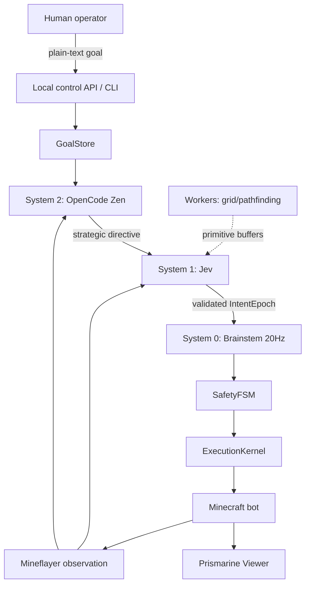

# VoxelCortex Project Master Document

**Repository:** NeuroBlock  
**Runtime name:** VoxelCortex  
**Status:** Local active-agent development  
**Last updated:** 2026-09-26

## 1. Mission

VoxelCortex is a Minecraft agent that combines:

- A synchronous System 0 safety brainstem.
- Jev/TypeSafe System 1 for fast validated action selection.
- OpenCode Zen System 2 for slower strategic interpretation.
- Mineflayer for Minecraft control.
- Worker-thread navigation uses bounded A* over transferred primitive grids.
- Prismarine Viewer for local browser observation.
- A localhost goal API and CLI for human direction.

The design principle is:

```text
Human goal -> System 2 strategy -> System 1 intent -> System 0 safety -> Mineflayer
```

The human never sends raw Minecraft actions. The human supplies goals; the
agent reasons about them and System 0 remains the final execution authority.

## 2. Current runtime

The local development runtime is started with:

```powershell
npm run dev:viewer
```

It connects to the local Paper server, starts the browser viewer, and after
Mineflayer `spawn` starts the active agent runtime.

Current local endpoints:

- Viewer: <http://localhost:3000>
- Control API: <http://127.0.0.1:8787>
- Status: <http://127.0.0.1:8787/status>
- Minecraft: `localhost:25565`

The compatible local server is Paper `1.21.11`; Paper `26.2` is incompatible
with the installed Mineflayer protocol data. The development server uses
`online-mode=false` and must not be exposed to the public internet. The old
incompatible `server` directory was removed; keep
`server-1.21.11` as the only local Paper installation.

## 3. Architecture



### System 0 — safety and execution

Files:

- [`src/system0/brainstem_tick.ts`](./src/system0/brainstem_tick.ts)
- [`src/system0/safety_fsm.ts`](./src/system0/safety_fsm.ts)
- [`src/system0/execution_kernel.ts`](./src/system0/execution_kernel.ts)
- [`src/system0/ring_buffer.ts`](./src/system0/ring_buffer.ts)

Responsibilities:

- Run safety checks on the 20Hz path.
- Reject stale intents.
- Fall back to idle when unsafe or when no valid intent exists.
- Be the only layer allowed to mutate Mineflayer state.

Hard boundary: no provider network calls, heavy parsing, or worker blocking in
the brainstem tick.

### System 1 — fast action selection

Files:

- [`src/system1/jev_client.ts`](./src/system1/jev_client.ts)
- [`src/system1/firewall.ts`](./src/system1/firewall.ts)
- [`src/system1/circuit_breaker.ts`](./src/system1/circuit_breaker.ts)

System 1 receives the System 2 directive, primitive world state, and allowed
capabilities. It chooses one action from the validated set:

`move`, `attack`, `mine`, `eat`, `craft`, `idle`.

The live Jev adapter uses the TypeSafe SDK and is asynchronous. Strict generic
deadline enforcement is not currently active; add it with tests before
claiming that guarantee.

### System 2 — strategy

Files:

- [`src/system2/strategic_loop.ts`](./src/system2/strategic_loop.ts)
- [`src/system2/opencode_client.ts`](./src/system2/opencode_client.ts)

System 2 receives the human goal and world context, then produces a concise
strategic directive. It does not call Mineflayer or execute actions. It refreshes
on startup, when the goal changes, and on its slower interval.

### Runtime and control

Files:

- [`src/runtime/agent_runtime.ts`](./src/runtime/agent_runtime.ts)
- [`src/core/goal_store.ts`](./src/core/goal_store.ts)
- [`src/control/control_server.ts`](./src/control/control_server.ts)
- [`scripts/goal.ts`](./scripts/goal.ts)
- [`src/dev/offline_viewer.ts`](./src/dev/offline_viewer.ts)

`AgentRuntime` composes the providers, goal store, brainstem, control API, and
decision cadence after bot spawn.

## 4. Goal operations

Set a goal:

```powershell
npm run goal -- set "Find a village and build a shelter"
```

Inspect status:

```powershell
npm run goal -- status
```

Clear the goal:

```powershell
npm run goal -- clear
```

Equivalent API:

```http
GET /
POST /goal {"goal":"..."}
DELETE /goal
GET /status
```

The API binds to `127.0.0.1` by default, limits request bodies, and exposes no
direct action endpoint. Status exposes lifecycle, decision count, and latest
runtime error for troubleshooting.

## 5. Configuration

Copy [`.env.example`](./.env.example) to `.env`. Never commit `.env`.

### Minecraft

- `MINECRAFT_HOST`
- `MINECRAFT_PORT`
- `MINECRAFT_USERNAME`
- `MINECRAFT_VERSION`
- `VIEWER_PORT`
- `CONTROL_PORT`

### System 1

- `TYPESAFE_API_KEY`
- `JEV_API_URL`
- `JEV_MODEL`

### System 2

- `OPENCODE_API_URL`
- `OPENCODE_API_KEY`
- `OPENCODE_MODEL`

The current successful free OpenCode model is `space-bunny-free`; model
availability is account/provider dependent. API keys are never logged or
placed in source code.

## 6. Commands and quality gates

```powershell
npm install
npm run typecheck
npm run build
npm test
npm run diagnose:jev
npm run diagnose:opencode
npm run probe:opencode-free
npm run dev:viewer
```

Minimum gate for every code change:

1. `npm run typecheck`
2. `npm test`
3. `npm run build`

Run provider diagnostics when changing provider configuration or adapters. Run
the viewer smoke test when changing runtime, Mineflayer, control, or viewer
code.

## 7. Hard invariants

1. `ExecutionKernel` is the sole Mineflayer mutation boundary.
2. System 0 remains synchronous and safety-first.
3. Provider calls never execute inside the 20Hz tick.
4. Worker messages contain primitive serializable data and transferable buffers,
   never Mineflayer objects.
5. LLM responses are validated and stale responses are discarded. Strict
   provider deadline enforcement remains unimplemented.
6. System 2 produces directives; System 1 produces intents; System 0 executes.
7. Local control binds to loopback unless an explicit security design is added.
8. Errors are observable; do not silently convert failures into success.

## 8. Known limitations

- Unwired generic LLM, configuration, performance, and telemetry scaffolds were
  deleted under VC-015. Worker navigation is now active when enabled.
- The 20Hz path needs a deeper allocation/performance audit before production.
- Crafting currently selects the first available recipe for the requested item;
  production-grade recipe planning remains future work.
- The local server is intentionally offline/insecure and is for development
  only.
- No remote authenticated control plane or persistence database exists.
- Remote control remains blocked until explicit owner approval and security
  design. Local control is loopback-only.

## 9. Agent handoff

Read this file and [`AGENTS.md`](./AGENTS.md) before editing. Use
[`TODO.md`](./TODO.md) as the durable work queue. Do not create a competing
plan file. Update the task ledger when work starts, when it is blocked, and
when it is verified.

### Pending implementation order

VC-015, VC-007, VC-008, VC-009, and VC-011 are complete. VC-013 remains
blocked by the remote-control approval gate. Do not claim strict provider
deadline or performance guarantees without active enforcement and tests.
